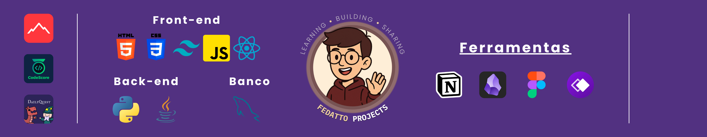

<h1 align="center">I'M VICTOR HUGO FEDATTO!</h1>

  <i>
    <a href="https://mylink.com" target="_blank" style="text-decoration: none;">
      Fedatto's Landing Page 
    </a>
  </i>

---

  
  
  

---

👋Hello! My name is Victor Hugo Fedatto, I'm Brazilian, a Law (FICV) and Computer Science (UNIESP) student. I'm always looking to learn new programming technologies.

📚Currently, I'm improving my skills in Front-end,Python, database and working on personal projects.

---

<h3 align="left">== My Stack ==</h3>

###

  
  
  
  
  
  
  
  
  
  
  
  
  
  
  

<h3 align="left">== Technologies ==</h3>

  
  
  
  
  

###

---

<h2 align="center">== My GitHub Status ==</h2>

###

  
  <!---->
   <!-- -->

###

<h2 align="center">MAIN PROJECTS</h2>

  <i>
    <a href="https://mylink.com" target="_blank" style="text-decoration: none;">
      StepUp 
    </a>
    <a href="https://mylink.com" target="_blank" style="text-decoration: none;">
      CodeScore 
    </a>
    <a href="https://mylink.com" target="_blank" style="text-decoration: none;">
      GerenciALL 
    </a>
  </i>

 

###

<h2 align="center">==🌐 Languages I speak 🌐==</h2>

  
  
  
  
  
  
  

I speak portuguese (native), English (B2 certificate), Spanish (beginner) and German (beginner)

###

<picture align="center">
  <source media="(prefers-color-scheme: dark)" srcset="https://raw.githubusercontent.com/vhfedatto/vhfedatto/output/github-contribution-grid-snake-dark.svg">
  <source media="(prefers-color-scheme: light)" srcset="https://raw.githubusercontent.com/vhfedatto/vhfedatto/output/github-contribution-grid-snake-dark.svg">
  
</picture>

