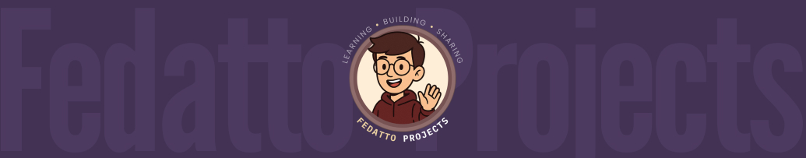
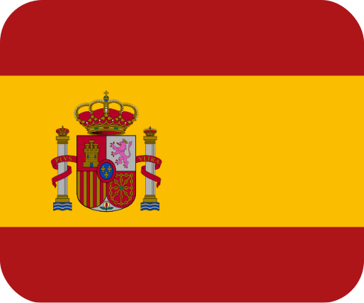
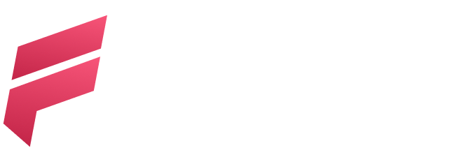

<h1 align="center">👋 I'M VICTOR H. FEDATTO!</h1> 

<!--

  <a href="https://mylink.com" target="_blank" style="text-decoration: none;">
    <i>Fedatto's Landing Page</i> 
    
  </a>

--- -->

  

  
    
  
  

<h2 align="left">📌 About Me</h2>

-  Brazilian, 20 year old, student of **Law (FICV)** and **Computer Science (UNIESP)**
- 📚 Passionate about **Java**, but currently focused on **Ruby**, **JS**, **UX/UI design**, and documentation

---

<h3 align="left">💻 My Stack</h3>

###

  
  
  
  
  
  
  
  
  
  
  
  
  
  
  <!--
  -->
  

 

<h3 align="left">🧰 Technologies & Tools</h3>

  
  
  
  
  
  
  
  
  

###

<h2 align="center">📈 My GitHub Status 📈</h2>

###

   <!--width="433"-->
  <!---->
   <!--  width="350"-->
  
  <!----> 

<!-- OUTRO TIPO DE RANK DE LINGUAGENS - PEGUEI DE UM PERFIL JAPA

  

-->

###

<!-- <h2 align="center">🚀 Main Projects 🚀</h2>

  <a href="https://github.com/vhfedatto/pjt-Stepup" target="_blank">
    StepUp 
  </a>
  <a href="https://github.com/vhfedatto/code-score" target="_blank">
    CodeScore 
  </a>
  <a href="https://github.com/vhfedatto/gerenciall" target="_blank">
    GerenciALL 
  </a>

-->

###
 

<h2 align="center">🌍 Languages I speak 🌍</h2>

  
  
  
  
  
  
  <!---->

###

<h2>✨ Extras</h2>

- 🎨 I also work with **pixel art**, **design**, and **RPG Maker game development**
- 🎯 I strive to unite **faith**, **logic**, and **creativity** in everything I do

###

 
  <!---->
  

 

  

