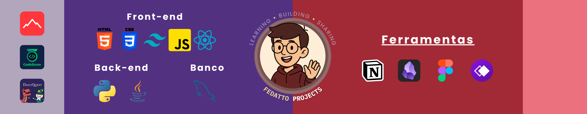

<h1 align="center">I'M VICTOR HUGO FEDATTO!</h1>

  <i>
    <a href="https://seuportifolio.com" target="_blank" style="text-decoration: none;">
      Fedatto's Landing Page 
    </a>
  </i>

---

  
  
  
  

---

👋Hello! My name is Victor Hugo Fedatto, I'm Brazilian, a Law (FICV) and Computer Science (UNIESP) student. I'm always looking to learn new programming technologies.

📚Currently, I'm improving my skills in Front-end,Python, database and working on personal projects.

🌐I speak: Portuguese (native), English (B2), Spanish (begginer) and German (beginner)

---
<h2 align="left">I CODE WITH</h2>

###

  
  
  
  
  
  
  
  
  
  
  

###

<h2 align="center">My GitHub Status</h2>

###

  
  
  

###

